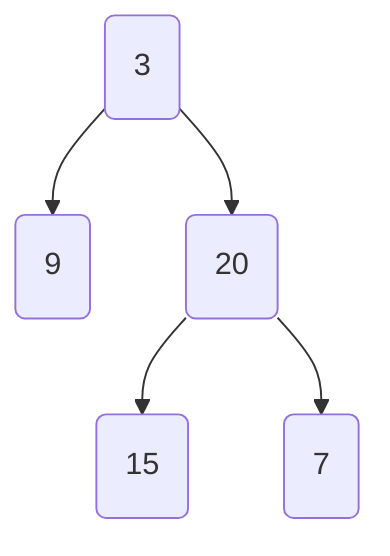
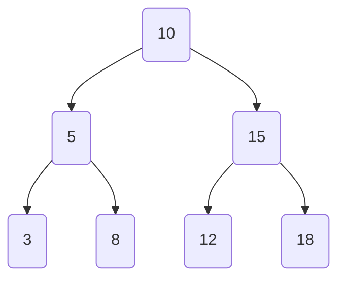

# Algorithms

## Big O Notation

* how code slows as the data grows
* describes the performance of an algorithm as the amount of data increases
* machine independent (# of steps to completion)


## Examples

`n` is the amount of data we're passinig in.

* `O(1)`: constant time
  * random access of an element in an array
  * inserting at the beginning of a linked list
    ```java
    public int add(int a, int b) {
    return a + b;
    }
    ```
* `O(n)`: linear time
  * looping through elements in an array
  * searching through a linked list
    ```java
    public void printNumbers(int n) {
        for (int i = 1; i <= n; i++) {
            System.out.println(i);
        }
    }
    ```
* `O(log n)`: logarithmic tim
  * binary search
    ```java
    public static int binarySearch(int[] arr, int target) {
        int left = 0, right = arr.length - 1;
        while (left <= right) {
            int mid = (left + right) / 2;
            if (arr[mid] == target) return mid;
            if (arr[mid] < target) left = mid + 1;
            else right = mid - 1;
        }
        return -1;
    }
    ```
* `O(n log n)`: quasilinear time
  * quicksort
  * mergesort
  * heapsort
* `O(n^2)`: quadratic time
    * insertion sort
    * selection sort
    * bubble sort
    ```java
    public void quadraticAlgorithm(int[] array) {
        int n = array.length;
        for (int i = 0; i < n; i++) {
            for (int j = 0; j < n; j++) {
                // Do something (e.g., print array[i] and array[j])
            }
        }
    }
    ```

## Binary tree

Hierarchichal data structure composed of zero, one or two child nodes. 



### Recursive traversal through a binary tree

Search time complexity is `O(n)` because each node is visited once and the work done on each node (checking if it's a leaf node) is `O(1)`.

```java
public static int maxDepth(TreeNode root) {
    if (root == null) return 0;
    if (root.left == null && root.right == null) return 1;

    int leftDepth = maxDepth(root.left);
    int rightDepth = maxDepth(root.right);

    return Math.max(leftDepth, rightDepth) + 1;
}
```

### Binary search tree

A binary search tree is a specific type of binary tree where the left child is "smaller" than the parent, and the right child is "larger" than the parent, effectively reducing the problem size by half.

* Doesn't have to be balanced
* Doesn't have to have the center value as the root node.
* Average time complexity O(log n)
* Worst case time complexity is O(n), when the tree is unbalanced (ie each node only has one child)
* The left-most child should be the least value, and the right-most child should be the greatest value
* Nodes are arranged this way for quick lookup
  


## Binary Tree BFS

A Breadth-First Search (BFS) algorithm is widely used for traversing graphs and trees, including binary trees. The BFS algorithm is typically implemented using a queue data structure to ensure that nodes at each level are processed before moving to the next level.

1. Initialize a queue data structure (often a queue or a deque) to store nodes to be processed.
2. Enqueue the root node (or the starting node) into the queue to initiate the traversal.
3. Start a loop that continues until the queue is empty.
4. In each iteration of the loop:
    1. Dequeue the node at the front of the queue.
    2. Process the node (e.g., record its value, perform some operation, or check for specific conditions).
5. Enqueue all unvisited neighbor nodes of the current node into the queue. This step ensures that the traversal moves to the next level in a graph or to the children of a node in a tree.
6. Repeat the loop until the queue is empty. This ensures that all nodes at each level are visited before moving to the next level.
7. The BFS traversal is complete when all nodes have been processed.

**Finding the average of each level example**
```java
    public List<Double> averageOfLevels(final TreeNode root) {
        final List<Double> averages = new ArrayList<>();

        if (root == null) {
            return averages;
        }

        final Queue<TreeNode> queue = new LinkedList<>();
        queue.offer(root);

        while (!queue.isEmpty()) {
            final int levelSize = queue.size();
            double levelSum = 0.0;

            for (int i = 0; i < levelSize; i++) {
                final TreeNode node = queue.poll();
                if (node != null) {
                    levelSum += node.val;

                    if (node.left != null) {
                        queue.offer(node.left);
                    }

                    if (node.right != null) {
                        queue.offer(node.right);
                    }
                }
            }

            averages.add(levelSum / levelSize);
        }

        return averages;
    }
```