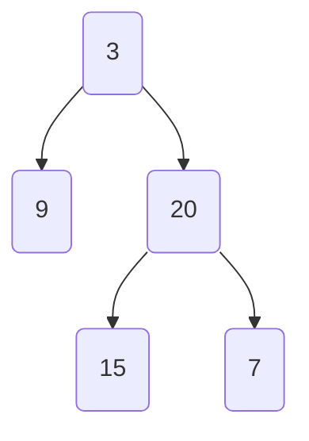
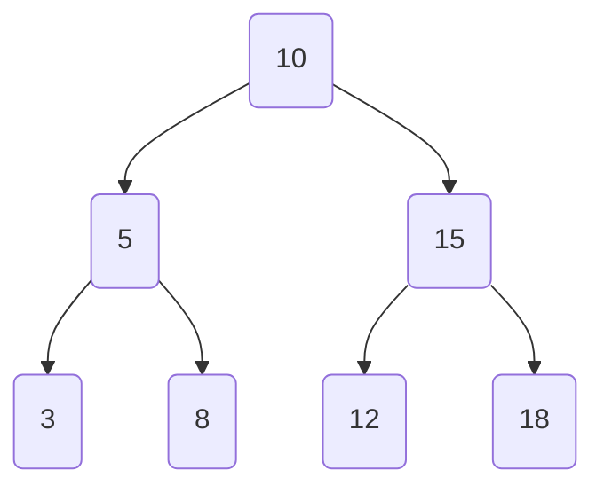

# Algorithms

## Binary tree

Hierarchichal data structure composed of zero, one or two child nodes. 



### Recursive traversal through a binary tree

Search time complexity is `O(n)` because each node is visited once and the work done on each node (checking if it's a leaf node) is `O(1)`.

```java
public static int maxDepth(TreeNode root) {
    if (root == null) return 0;
    if (root.left == null && root.right == null) return 1;

    int leftDepth = maxDepth(root.left);
    int rightDepth = maxDepth(root.right);

    return Math.max(leftDepth, rightDepth) + 1;
}
```

## Binary search tree

A binary search tree is a specific type of binary tree where the left child is "smaller" than the parent, and the right child is "larger" than the parent, effectively reducing the problem size by half.

* Doesn't have to be balanced
* Doesn't have to have the center value as the root node.
* Average time complexity O(log n)
* Worst case time complexity is O(n)
  
