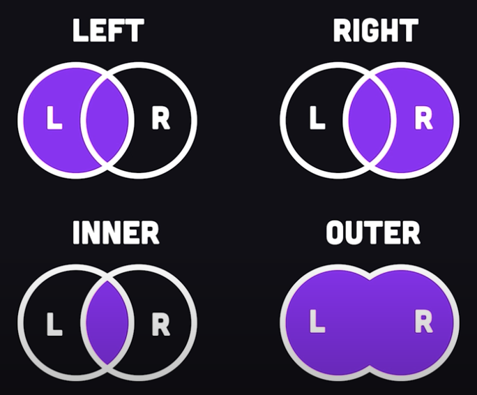

# Databases

## ACID

Atomicity, Consistency, Isolation, and Durability. It is a set of properties that guarantee reliable processing of database transactions.

* `Atomicity`: This property ensures that a database transaction is treated as a single, indivisible unit. Either all the changes made by the transaction are committed to the database, or none of them are. If any part of the transaction fails, all changes are rolled back, and the database remains in a consistent state.

* `Consistency`: The consistency property ensures that a transaction brings the database from one consistent state to another. The database must satisfy a set of integrity constraints or rules both before and after the transaction. If a transaction violates any constraints, it is rolled back, and the database remains unchanged. Constraint examples include unique name or id or name must be > 2 chars.

* `Isolation`: Isolation ensures that concurrent transactions do not interfere with each other. Each transaction should appear as if it is executed in isolation, without any knowledge of other concurrent transactions. Isolation prevents issues such as dirty reads, non-repeatable reads, and phantom reads that can occur when multiple transactions access the same data simultaneously.

* `Durability`: The durability property guarantees that once a transaction is committed, its effects are permanent and will survive any subsequent system failures (such as a power outage or a crash). This is typically achieved through mechanisms like write-ahead logging and periodic data backups.

## SQL data types

| Data Type     | Description                                             | Example            |
| ------------- | ------------------------------------------------------- | ------------------- |
| CHAR(n)       | Fixed-length character string                          | CHAR(10)           |
| VARCHAR(n)    | Variable-length character string                       | VARCHAR(255)       |
| TEXT          | Variable-length character string (large max length)    | TEXT               |
| INT           | 32-bit signed integer                                  | INT               |
| BIGINT        | 64-bit signed integer                                  | BIGINT            |
| DECIMAL(p, s) | Fixed-point decimal number with precision and scale   | DECIMAL(10, 2)     |
| FLOAT(p)      | Floating-point number with precision                   | FLOAT(10)          |
| DATE          | Date without time information                          | DATE               |
| TIME          | Time without date information                          | TIME               |
| DATETIME      | Date and time combined                                 | DATETIME           |
| TIMESTAMP     | Timestamp with date and time                           | TIMESTAMP           |
| BOOLEAN       | Synonym for TINYINT (can store 0 for false, 1 for true) | BOOLEAN           |
| BLOB          | Binary Large Object (for binary data)                  | BLOB               |
| ENUM          | A column with predefined set of values                | ENUM('Val1', 'Val2') |

## Group By

Groups the result set by one or more columns. It is used in combination with aggregate functions like `COUNT`, `SUM`, `AVG`, `MIN`, and `MAX` to perform calculations on the grouped data.

```sql
-- given
+--------------+-------------+----------+
| CustomerName | OrderDate   | Amount   |
+--------------+-------------+----------+
| Alice        | 2023-10-01  | 100.00   |
| Bob          | 2023-10-02  | 75.00    |
| Alice        | 2023-10-03  | 50.00    |
| Carol        | 2023-10-01  | 200.00   |
| Bob          | 2023-10-02  | 90.00    |
+--------------+-------------+----------+

SELECT CustomerName, SUM(Amount) AS TotalAmount
FROM Orders
GROUP BY CustomerName;

-- result
+--------------+--------------+
| CustomerName | TotalAmount  |
+--------------+--------------+
| Alice        | 150.00       |
| Bob          | 165.00       |
| Carol        | 200.00       |
+--------------+--------------+
```

## Joins

There are four types of joins:

* inner join
* left join
* right join
* outter join



### Left join
Returns all rows from the left table and the matching rows from the right table. Non-matching rows from the right table are excluded

```sql
SELECT Customers.CustomerName, Orders.OrderID
FROM Customers
LEFT JOIN Orders ON Customers.CustomerID = Orders.CustomerID;
```

### Right join

Returns all rows from the right table and the matching rows from the left table. Non-matching rows from the left table are excluded

 ```sql
 SELECT Customers.CustomerName, Orders.OrderID
FROM Customers
RIGHT JOIN Orders ON Customers.CustomerID = Orders.CustomerID;
```

### Inner join

Returns only the matching rows from both tables
Non-matching rows from either table are excluded

```sql
SELECT Customers.CustomerName, Orders.OrderID
FROM Customers
LEFT JOIN Orders ON Customers.CustomerID = Orders.CustomerID;
```

### Outer join

Returns all rows from both tables, matching or non-matching
Where no match exists, `NULL` values are returned for missing columns

```sql
SELECT Customers.CustomerName, Orders.OrderID
FROM Customers
FULL JOIN Orders ON Customers.CustomerID = Orders.CustomerID;
```

## Indexes

Indexes are database structures used to improve the speed and efficiency of data retrieval operations. There are two primary types of indexes: clustered indexes and non-clustered indexes, each serving a different purpose.

Clustered Index:

* A clustered index determines the physical order of data rows in a table.
* There can be only one clustered index per table because the physical order of rows can't be changed simultaneously in multiple ways.
* When you create a clustered index on a table, the data rows are rearranged and stored in the same order as the index key. This means that the data in the table is physically sorted based on the clustered index key.
* Typically, the primary key of a table is used as the clustered index, but it's not mandatory. If a table doesn't have a clustered index, it is referred to as a heap, and data rows are stored in no particular order.
* Because the data rows are stored in the order of the clustered index, queries that use the clustered index key for filtering or sorting can be very fast, as SQL Server can perform binary searches to locate the data.

Non-Clustered Index:

* A non-clustered index is a separate structure that contains a copy of selected columns from the indexed table along with a reference to the actual data row's location.
* Multiple non-clustered indexes can be created on a single table.
* Non-clustered indexes are generally used to improve the performance of SELECT queries that filter or sort data based on columns that are not part of the clustered index.
* When you create a non-clustered index, you specify the columns you want to include in the index and the order in which they should be sorted.
* Non-clustered indexes are slower for retrieving data compared to clustered indexes because they involve an additional lookup step to find the actual data rows after locating the indexed values in the index.

In summary, a clustered index determines the physical order of data rows in a table and is often associated with the primary key of the table. Non-clustered indexes are separate structures used to speed up data retrieval for queries that filter or sort data based on columns not part of the clustered index. It's common to have both types of indexes on a table to optimize various types of queries.

## DB query libraries

### jOOQ

* Type-safe query construction.
* Generate jOOQ classes based on the db schema
* SQL centric
* commonly used for apps that require complex or advanced SQL (eg window functions)

```java
dsl.select(BOOKS.TITLE, AUTHORS.NAME)
   .from(BOOKS)
   .join(AUTHORS).on(BOOKS.AUTHOR_ID.eq(AUTHORS.ID))
   .fetch()
   .forEach(record -> {
       String bookTitle = record.get(BOOKS.TITLE);
       String authorName = record.get(AUTHORS.NAME);
       System.out.println("Book Title: " + bookTitle + ", Author: " + authorName);
   });
```


### Querydsl

* type-sava DSL for constructing db queries
* fluid API
* db agnostic
* integrates with JPS and Hibernate (optional)
* has NoSQL support
* Can generate query and entity classes from the db schema

```java
SQLQuery<Void> query = new SQLQuery<Void>(connection, configuration);

// Example query: Select book titles and their authors
query
    .select(QBooks.books.title, QBooks.authors.name)
    .from(QBooks.books)
    .join(QBooks.authors).on(QBooks.books.authorId.eq(QBooks.authors.id));

// Fetch and iterate over the results
query.fetch().forEach(row -> {
    String bookTitle = row.get(QBooks.books.title);
    String authorName = row.get(QBooks.authors.name);
    System.out.println("Book Title: " + bookTitle + ", Author: " + authorName);
});
```

## Advanced features

### Window function

Allows you to perform calculations across a set of rows related to the current row within the result set. Window functions are typically used in analytical or reporting queries to gain insights into the data and perform complex calculations over partitions of data.

```sql
SELECT
    employee_id,
    employee_name,
    department,
    salary,
    AVG(salary) OVER (PARTITION BY department ORDER BY salary) AS avg_salary_in_dept
FROM
    employees;
```

1. For each row in the result set (representing an employee):
2. The `PARTITION BY` department clause divides the result set into partitions, with each partition containing rows for a specific department.
Within each partition, the window function (in this case, AVG(salary)) calculates the average salary based on the rows in that department.
3. The result of this calculation is then added to the employee's record in a new column (in this case, avg_salary_in_dept) for that employee.

#### Common window functions

| Window Function        | Description                                                |
|------------------------|------------------------------------------------------------|
| RANK()                 | Assigns a unique rank to each row based on column values. |
| DENSE_RANK()           | Assigns rank without gaps for tied values.               |
| ROW_NUMBER()           | Assigns a unique sequential integer to each row.          |
| LEAD()                 | Accesses values of subsequent rows within the partition.  |
| LAG()                  | Accesses values of preceding rows within the partition.   |
| FIRST_VALUE()          | Provides the first row's value within the window frame.   |
| LAST_VALUE()           | Provides the last row's value within the window frame.    |
| SUM()                  | Calculates the sum of a numeric column in the frame.     |
| AVG()                  | Computes the average of a numeric column in the frame.   |
| MIN()                  | Finds the minimum value in the window frame.             |
| MAX()                  | Identifies the maximum value in the window frame.        |
| COUNT()                | Counts the number of rows in the window frame.           |
| NTILE()                | Divides rows into equally sized buckets and assigns ranks.|
| PERCENT_RANK()         | Calculates relative rank as a fraction (percentile rank).|
| CUME_DIST()            | Computes cumulative distribution as a percentage.        |
| PERCENTILE_CONT()      | Computes a continuous percentile within the window frame. |
| PERCENTILE_DISC()      | Computes a discrete percentile within the window frame.   |
| LAG DIFF()             | Calculates the difference between current and preceding rows.|


## Graphs

Graphs can be represented in a relational database as an `Adjacency List Model`.

* In this model, you use two tables: one to store nodes and another to store edges.
* The "nodes" table stores information about individual nodes (vertices) in the graph.
* The "edges" table stores information about the relationships between nodes, typically with foreign key references to the "nodes" table.

*Graph tables*
```sql
-- nodes
| node_id | node_name   |
|---------|------------|
| 1       | Node A     |
| 2       | Node B     |
| 3       | Node C     |

-- edges
| edge_id | from_node_id | to_node_id |
|---------|-------------|------------|
| 1       | 1           | 2          |
| 2       | 1           | 3          |
```

*Real-world example*
```sql
-- people
| person_id | name       | birthdate  |
|-----------|------------|------------|
| 1         | John       | 1970-05-15 |
| 2         | Mary       | 1975-08-22 |
| 3         | Susan      | 2000-03-10 |
| 4         | Michael    | 2005-11-30 |


-- relationships
| relationship_id | from_person_id | to_person_id | relationship    |
|-----------------|----------------|--------------|-----------------|
| 1               | 1              | 2            | Spouse          |
| 2               | 1              | 3            | Child           |
| 3               | 2              | 3            | Child           |
| 4               | 3              | 4            | Sibling         |

-- Suppose you want to find all the children of a specific person, for example, John. 
SELECT people.name AS child_name
FROM people
JOIN relationships ON people.person_id = relationships.to_person_id
WHERE relationships.from_person_id = 1
AND relationships.relationship = 'Child';

```
