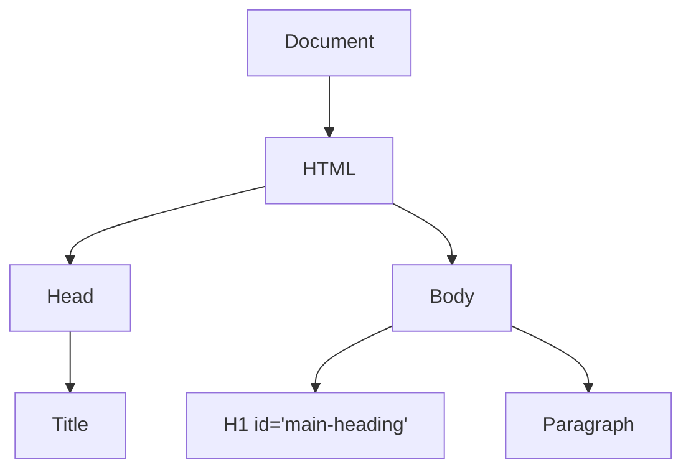

# DOM

* [Mozilla documentation](https://developer.mozilla.org/en-US/docs/Web/API/Document_Object_Model)
* programming interface for html
* a tree structure whose nodes represent an HTML or XML document's contents
* allows scripts to interact with the web page dynamically
* not part of Javascript, but is instead a Web API; implementations of the DOM can be built for other languages
* access the API directly in JS from a script


## Tree structure

The DOM represents the web page as a tree-like structure, where each HTML element, attribute, and piece of text is represented as a node in the tree.



### Document object

The top-level object is the `document`, representing the entire HTML document and providing methods and properties for interacting with the page.

### Nodes

The DOM tree consists of various types of nodes, including elements, attributes, text, and more. Elements are the HTML tags, attributes are properties of elements, and text nodes represent text content.

## API

You can access elements in the DOM using various methods, such as `getElementById`, `querySelector`, and `getElementsByClassName`. These methods allow you to find and reference specific elements on the page. Once you've obtained a reference to an element, you can manipulate its content, attributes, and style, as well as attach event listeners to enable dynamic behavior.

Some common DOM methods:

| Method/Property                                 | Description                                                                                                    |
| ----------------------------------------------- | -------------------------------------------------------------------------------------------------------------- |
| `document.querySelector(selector)`              | Returns the first element that matches the specified CSS selector.                                             |
| `document.querySelectorAll(selector)`           | Returns a NodeList of all elements that match the specified CSS selector.                                      |
| `document.createElement(tagName)`               | Creates a new HTML element with the specified tag name.                                                        |
| `Element.innerHTML`                             | Gets or sets the HTML content of an element, including its descendants.                                        |
| `Element.setAttribute(name, value)`             | Sets the value of an attribute on an element.                                                                  |
| `Element.getAttribute(name)`                    | Retrieves the value of an attribute from an element.                                                           |
| `EventTarget.addEventListener(event, callback)` | Adds an event listener to an element or object, executing a callback function when the specified event occurs. |
| `HTMLElement.style`                             | Provides access to the inline CSS styles of an element, allowing you to get or set CSS properties.             |
| `Node.appendChild(node)`                        | Appends a node as a child to another node, such as adding an element to the DOM.                               |
| `window.onload`                                 | An event that fires when the entire web page, including all external resources, has loaded.                    |
| `window.scrollTo(x, y)`                         | Scrolls the window to the specified coordinates (x, y) on the page.                                            |

## Events

Events are things that happen when a user interacts with a web page or when certain conditions are met. These events allow web developers to create interactive and dynamic web applications.

### Types of events

| Event Type         | Description                                                            |
| ------------------ | ---------------------------------------------------------------------- |
| `click`            | Occurs when an element is clicked.                                     |
| `mouseover`        | Triggered when the mouse pointer enters an element.                    |
| `mouseout`         | Fired when the mouse pointer leaves an element.                        |
| `keydown`          | Occurs when a key is pressed down.                                     |
| `keyup`            | Fired when a key is released after being pressed.                      |
| `submit`           | Triggered when a form is submitted.                                    |
| `change`           | Occurs when the value of an input element changes.                     |
| `focus`            | Fired when an element receives focus.                                  |
| `blur`             | Occurs when an element loses focus.                                    |
| `load`             | Triggered when a page or resource has finished loading.                |
| `unload`           | Fired when the user leaves the page.                                   |
| `resize`           | Occurs when the browser window is resized.                             |
| `scroll`           | Fired when the user scrolls the page.                                  |
| `input`            | Triggered when an input element's value changes.                       |
| `DOMContentLoaded` | Occurs when the initial HTML document is completely loaded and parsed. |

### Event handlers

To react to an event, you attach an `event handler`, which is a JavaScript function that is executed in response to specific events.

Some common event handlers:

| Event Handler   | Description                                                                                   |
| --------------- | --------------------------------------------------------------------------------------------- |
| `onclick`       | Triggered when an element is clicked.                                                         |
| `onmouseover`   | Fired when the mouse pointer enters the element.                                              |
| `onmouseout`    | Occurs when the mouse pointer leaves the element.                                             |
| `onchange`      | Triggered when the value of an input element changes.                                         |
| `onsubmit`      | Fired when a form is submitted.                                                               |
| `onkeydown`     | Triggered when a key is pressed down.                                                         |
| `onkeyup`       | Fired when a key is released after being pressed.                                             |
| `onload`        | Occurs when a web page or an element is fully loaded.                                         |
| `onunload`      | Fired when a page is about to be unloaded (e.g., when the user navigates away from the page). |
| `onfocus`       | Triggered when an element receives focus (e.g., input fields when clicked on).                |
| `onblur`        | Occurs when an element loses focus.                                                           |
| `onerror`       | Fired when an error occurs while loading an external resource (e.g., an image).               |
| `ontouchstart`  | Triggered when a touch event starts (for mobile and touch devices).                           |
| `ontouchend`    | Occurs when a touch event ends.                                                               |
| `onscroll`      | Fired when the user scrolls within an element.                                                |
| `onresize`      | Triggered when the window or an element is resized.                                           |
| `oncontextmenu` | Occurs when the user right-clicks on an element.                                              |
| `ondragstart`   | Fired when an element starts to be dragged (used with the HTML5 `draggable` attribute).       |
| `ondrop`        | Triggered when a dragged element is dropped (used with the HTML5 `draggable` attribute).      |

*Example of `onClick`*

```javascript
<!DOCTYPE html>
<html>
<head>
  <title>Event Handler Example</title>
</head>
<body>
  <button id="myButton">Click Me</button>

  <script>
    // Get a reference to the button element
    const myButton = document.getElementById("myButton");

    // Define an event listener function
    function handleClick() {
      alert("Button clicked!");
    }

    // Attach the event listener to the button
    myButton.addEventListener("click", handleClick);
  </script>
</body>
</html>
```

### Event objects

Event objects in JavaScript are special objects that provide information about events when they occur in the Document Object Model (DOM). These objects are automatically created by the browser and passed as arguments to event handler functions. Event objects contain important data and properties related to the event, allowing you to access details about the event and interact with it.

 Most standard DOM events, such as `click`, `mousedown`, `keydown`, `submit`, and `mouseover`, emit an event object. These events are triggered by user interactions or other actions in the browser, and the event object is automatically created and passed to event handler functions.

```javascript
element.addEventListener("click", function(event) {
    console.log(event.type); // Access the event type
    console.log(event.target); // Access the event target element
});
``