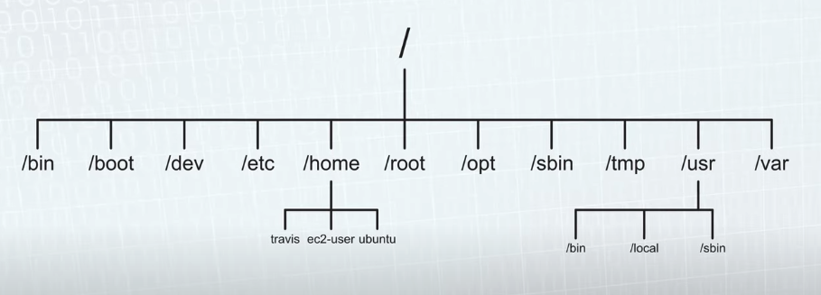

# Linux

## Quick commands

* Determine what process is running on a given port

	```
	$ lsof -i :3000
	```
	
* Kill a process
	
	```
	$ kill <PID>
	```

## File sytem

### Directories
	



* `/bin`: binaries
* `/sbin`: contains commands for a superuser
* `/usr/`: user related files
* `/usr/local`: installed software and libraries not part of the core system
* `/usr/bin`: user installed binaries
* `/opt`: optional, reserved for third-party software not part of the core system
* `/opt/bin`: optional executable binaries
* `/opt/lib`: optional libraries
* `/etc/`: system-wide config files
* `/home`: where the user's personal directory can be found
* `/lib`: libraries for system programs
* `/tmp`: temp files
* `/var`: variable data that can change, such as logs and run-time data
* `/dev`: device files
* `/dev/null`: special file that discards any data written to it and returns an end-of-file when read


### Permissions

#### Change owner

```bash
// Change the owner
$ chown <newowner> filename

// Change the owner and the gorup
$ chown <newowner>:<newgroup> filename
```

#### Change permissions

Use the chmod (stands for change mode) command.

Linux scoring system: r=4, w=2, x=1

```bash
$ sudo chmod 774 filename
```

#### Common permissions

| Permission | Description                            |
|------------|----------------------------------------|
| 644        | File baseline                          |
| 755        | Directory baseline                    |
| 400        | Key pair (like an encryption private key) |
