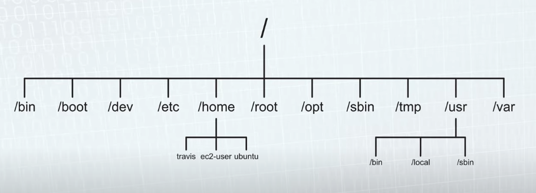

# Linux

## Shell

* `Piping`: sending the standard output of a command to the standard input of a command.
	```shell
	$ ls | grep networks
	```
* `Running multiple commands`: three ways to run multiple commands.
	```shell
	// 1. end a command with a `;`
	// executes the second command whether the first
	// command completes successfully or not
	$ cd ~; ls

	// 2. use `&&`
	// Only executes the second command if the first
	// is successful
	$ cd ~ && ls

	// 3. use `||`
	// Execute the first command, and if it fails,
	// execute the second
	$ cp apple.png images || mkdir images
	```
* `Find`: search for files or directories
	```shell
	$ find . -name main.py
	$ sudo find /etc -name *.conf
	$ find . -perm 664
	$ find /etc -type -d -name lvm
	```
* `Command redirection`: send the output of a command to a file
	```shell
	// overwrite redirect; if the file doesn't exist,
	// create it. if it does, overwrite it.
	$ ls > testfiles.txt

	// append
	$ echo "hello" >> testfiles.txt

	// input
	$ sort < contacts.txt > sorted_contacts.txt
	```
* `!!`: Run the previous command
  ```shell
  $ sudo !!
  ```
* `!n`: execute the command with history number `n`
	```shell
	$ history
	$ !25
	```
* `!-n`: executes the command n entries back in history
	```shell
	$!-3
	```
* `lsof`: (list open files) determine what process is running on a given port
	```
	$ lsof -i :3000
	```
* `kill`: kill a process
	```
	$ kill <PID>
	```

## File sytem

### Directories
	



* `/bin`: binaries
* `/sbin`: contains commands for a superuser
* `/usr/`: user related files
* `/usr/local`: installed software and libraries not part of the core system
* `/usr/bin`: user installed binaries
* `/opt`: optional, reserved for third-party software not part of the core system
* `/opt/bin`: optional executable binaries
* `/opt/lib`: optional libraries
* `/etc/`: system-wide config files
* `/home`: where the user's personal directory can be found
* `/lib`: libraries for system programs
* `/tmp`: temp files
* `/var`: variable data that can change, such as logs and run-time data
* `/dev`: device files
* `/dev/null`: special file that discards any data written to it and returns an end-of-file when read


### Permissions

#### Change owner

```bash
// Change the owner
$ chown <newowner> filename

// Change the owner and the gorup
$ chown <newowner>:<newgroup> filename
```

#### Change permissions

Use the chmod (stands for change mode) command.

Linux scoring system: r=4, w=2, x=1

```bash
$ sudo chmod 774 filename
```

#### Common permissions

| Permission | Description                            |
|------------|----------------------------------------|
| 644        | File baseline                          |
| 755        | Directory baseline                    |
| 400        | Key pair (like an encryption private key) |
