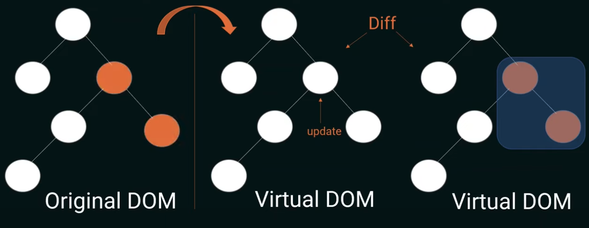

# React

- [React](#react)
  - [Virtual DOM](#virtual-dom)
    - [Virtual DOM changes](#virtual-dom-changes)
    - [Keys](#keys)
  - [Components](#components)
  - [Props](#props)
    - [Props drilling](#props-drilling)
  - [Context](#context)
  - [Component composition](#component-composition)
  - [Memoization](#memoization)
  - [Commands](#commands)
  - [Data types](#data-types)
  - [Conditional](#conditional)
  - [Hooks](#hooks)
    - [useState](#usestate)
      - [Initial state](#initial-state)
      - [Objects and arrays in state](#objects-and-arrays-in-state)
    - [useEffect](#useeffect)
      - [Examples](#examples)
    - [useRef](#useref)
      - [Examples](#examples-1)
    - [useCallback](#usecallback)
    - [useMemo](#usememo)
    - [useReducer](#usereducer)
  - [JSX](#jsx)
  - [Hosting on Vercel](#hosting-on-vercel)
  - [Using exteranl URL](#using-exteranl-url)
  - [Using local image](#using-local-image)
  - [Using require](#using-require)
  - [Using public image](#using-public-image)


* Uses and updates a virtual dom rather than updating the dom directly
* After the virtual dom is updated, a diff is made against the actual dom, and only the portion that has chanaged is re-rendered

## Virtual DOM

Because React is declarative, you don't  update the DOM directly. You tell React what to do and it updates the DOM for you.

React uses a virtual DOM, which is an in-memory replica of the actual DOM. Instead of directly modifying the real DOM, React applies updates to this virtual representation. Because it is in-memory, operations are faster and it is easier to synch with the original DOM.

### Virtual DOM changes

1. React generates a Virtual DOM, a replica of the actual DOM.
2. When a modification occurs, React duplicates the Virtual DOM, applies the change to the copy, and compares it to the original Virtual DOM.
3. React identifies differences through this diffing process and selectively updates only the necessary elements in the real DOM. For multiple changes, React batches the modifications and applies them together. This greatly improves performance vs. making changes directly to the DOM. This process is known as `reconcilliation`.



### Keys

Special attributes that can be added to elements when rendering lists of items. They are used to help React identify each item uniquely and efficiently update the UI when the list changes.

Keys:

* uniquely identify elements
* provide a stable identity across renders
* allow for efficient updates
* ensure that components with the same key are not re-created

*Creating a list with keys on each item:*

```javascript
const items = [
  { id: 1, text: "Item 1" },
  { id: 2, text: "Item 2" },
  { id: 3, text: "Item 3" },
];

const itemList = items.map((item) => (
  <div key={item.id}>{item.text}</div>
));

ReactDOM.render(itemList, document.getElementById("root"));
```
## Components

* organized in a tree-like structure
* plain Javascript function which must return JSX
* the component may have data private to itself, which is called `state`
* the component may share data with other components via `props`

```typescript
import React from 'react';

const MyComponent: React.FC = () => {
  return (
    <div>
      <h1>Hello, React with TypeScript!</h1>
      <p>This is a basic functional component.</p>
    </div>
  );
};

export default MyComponent;
```

## Props

* the primary way to pass data from parent components to child components
* unidirectional and considered immutable within the child component
* plain JavaScript objects that hold data or values
* defined as attributes on a JSX element

```javascript
<MyChildComponent name="John" age={25} />
```

* props are accessed as properties of the `props` object in the child

```typescript
import React from 'react';

interface MyChildComponentProps {
  name: string;
  age?: number;
}

const MyChildComponent: React.FC<MyChildComponentProps> = ({
  name,
  age = 30, // Default age if not provided
}) => {
  return (
    <div>
      <p>Name: {name}</p>
      <p>Age: {age}</p>
    </div>
  );
};

export default MyChildComponent;
```

### Props drilling

* when props need to be passed through multiple levels of nested componnts in order to reach a deeply nested child component that requires these prop
* occurs when a component that doesn't directly use certain props passes those props down to its child components until they reach the component that actually needs them
* can use context or component composition to pass data to descendents without explicitly passing it through as props

## Context

* allows you to share data between components with passing props
* makes information available to a hierarchy of components
* context is avialable via a `context provider`
* the provider wraps a part of the component tree, making the context avialable to all sub-components

```javascript
function App() {
  return (
    <ThemeContext.Provider value="dark">
      <Header />
      <MainContent />
    </ThemeContext.Provider>
  );
}
```

* consuermers can extract the information with the `useContext` hook
* there can be multiple contexts in an app
* to create a context, use the `React.createContext` function, which returns an object with `Provider` and `Consumer` components
```
const MyContext = React.createContext(initialValue);
```

*Example*
```javascript
// Creating a context
const ThemeContext = React.createContext('light');

// Providing the context at the top-level component
function App() {
  return (
    <ThemeContext.Provider value="dark">
      <Header />
      <MainContent />
    </ThemeContext.Provider>
  );
}

// Consuming the context in a child component
function Header() {
  const theme = useContext(ThemeContext);

  return (
    <header style={{ background: theme === 'dark' ? 'black' : 'white' }}>
      {/* ... */}
    </header>
  );
}
```

## Component composition

## Memoization

Optimizing components by preventing unnecessary re-renders. When you wrap a functional component with `React.memo`, it memoizes (caches) the component's rendered output based on its props. If the props of the component have not changed since the last render, React will reuse the memoized component without re-rendering it, which can significantly improve performance by avoiding unnecessary render operations.

*Example*
```typescript
import React, { FC, useMemo } from 'react';

interface ListItemProps {
  item: string;
}

const ListItem: FC<ListItemProps> = ({ item }) => {
  console.log(`Rendering item: ${item}`);
  return <li>{item}</li>;
};

interface ListProps {
  items: string[];
}

const List: FC<ListProps> = ({ items }) => {
  const memoizedItems = useMemo(
    () =>
      items.map((item, index) => (
        <ListItem key={index} item={item} />
      )),
    [items]
  );

  return <ul>{memoizedItems}</ul>;
};

export default List;
```

## Commands

| Description             | Command                                               |
| ----------------------- | ----------------------------------------------------- |
| Create a TypeScript app | `$ npx create-react-app my-app --template typescript` |
| Start the app           | `$ yarn start`                                        |
| Run tests               | `$ yarn test`                                         |
| Build                   | `$ yarn build`                                        |

## Data types

```typescript
// String
const topic = "React";

// int
const age = 12;

// boolean (would need to cast to String to view)
const isTrue = true;
String(true) // to view in the web page
```

## Conditional

**Ternary**

Use ternary instead of if-else.

```typescript
{
  age > 4 ? <h3>Is True</h3> : <h3>Is False</h3>
}
```

To loop, use the map method.

```javascript
  const likes = ["JSX", "React", "Redux"];`

  // Elements created by the map should have a key defined.
  // This is to allow React to know which elements to change when something changes.
  return (
    <div>
      {likes.map(like => (
        <h3 key={like}>{like}</h3>
      ))}
    </div>
  ); 
```
## Hooks

Standard hooks:

* [useState](https://react.dev/reference/react/useState)
* [useEffect](https://react.dev/reference/react/useEffect)
* useContext
* [useRef](https://react.dev/reference/react/useRef)
* [useMemo](https://react.dev/reference/react/useMemo) (memoization of results)
* [useCallback](https://react.dev/reference/react/useCallback) (memoization of function)
* [useReducer](https://react.dev/reference/react/useReducer)
* useLayoutEffect 

### useState

* declares and tracks state value within a component
* returns an array with two values: current state and a `set` update function
* when the state is changed, React re-renders the JSX to reflect the new value
* use the update method returned by the useState hook to change the state rather than changing it directly
* `set` doesn't change the original `state` reference value, instead creates a new reference which is used to re-render the dom. this is why you shouldn't change the `state` value directly but instead use the `set` method.

```typescript
import { useState } from 'react';

function MyComponent() {
  // useState() is initialized to 42. "age" is the state and "setAge"
  // is the update function (named "set" by convention)
  const [age, setAge] = useState(42);

  function handleClick() {
    setAge(23);
  }
```

Can pass in an updater function to update the state variable in running code.

```typescript
function handleClick() {
  // using an updater function
  setAge(a => a + 1); // setAge(42 => 43)
  setAge(a => a + 1); // setAge(43 => 44)
  setAge(a => a + 1); // setAge(44 => 45)

  setAge(a + 1); // doesn't update "age" the way you expect because the code is running. needs an updater function
}
```

#### Initial state

Accepts an optional initial value, which can be any valid javascript value or a function.

```typescript
// 🚩 calls "createInitialTodos()" for every render, but it only
// needs the inital render 
function TodoList() {
  const [todos, setTodos] = useState(createInitialTodos());
  // ...

// ✅ instead, pass a function "createInitialTodos" 
function TodoList() {
  const [todos, setTodos] = useState(createInitialTodos);
  // ...  
```

#### Objects and arrays in state
Can put objects in state, but replace rather than mutate the existing objects

```typescript
// 🚩 Don't mutate an object in state like this:
form.firstName = 'Taylor';

// ✅ Replace state with a new object
setForm({
  ...form,
  firstName: 'Taylor'
});
```

### useEffect

Side-effects are interactions with external systems that occur as a result of a component's rending or updating. Typical side-effects include:

* DOM manipulation
* data fetching (making async API calls)
* writing to storage
* subscription management

The most common way of managing side-effects is through the `useEffect` hook. With `useEffect`, you:

* provide a `setup` function that React will execute after rendering or re-rendering the component
* return a `cleanup` function to disconnect from the external system
* optionally, an array of dependencies as the hook's second argument, listing the values from the component used inside the function. When any of these dependencies change, the effect is triggered anew. If you omit the dependency array altogether, the effect runs after each render. 

#### Examples

*Run after every render*
```typescript
import React, { useState, useEffect } from 'react';

function MyComponent() {
  const [count, setCount] = useState(0);

  useEffect(() => {
    document.title = `Count: ${count}`;
  }); // no dependency array so this effect runs after every render

  return (
    <div>
      <p>Count: {count}</p>
      <button onClick={() => setCount(count + 1)}>Increment</button>
    </div>
  );
}
```

*Run once after first render*
```typescript
import React, { useState, useEffect } from 'react';

function MyComponent() {
  const [count, setCount] = useState(0);

  useEffect(() => {
    document.title = `Count: ${count}`;
  }, []); // runs once after initial render 

  return (
    <div>
      <p>Count: {count}</p>
      <button onClick={() => setCount(count + 1)}>Increment</button>
    </div>
  );
}
```

*Run only after state changes*
```typescript
import React, { useState, useEffect } from 'react';

function MyComponent() {
  const [count, setCount] = useState(0);

  useEffect(() => {
    document.title = `Count: ${count}`;
  }, [count]); // runs after 'count' state changes

  return (
    <div>
      <p>Count: {count}</p>
      <button onClick={() => setCount(count + 1)}>Increment</button>
    </div>
  );
}
```

*Run after props change*
```typescript
import React, { useState, useEffect } from 'react';

function MyComponent(props) {
  const [count, setCount] = useState(0);

  useEffect(() => {
    // Use the 'props' value in the effect
    document.title = `Count: ${props.somePropValue}`;
  }, [props.somePropValue]); // runs after 'somePropValue' changes

  return (
    <div>
      <p>Count: {count}</p>
      <button onClick={() => setCount(count + 1)}>Increment</button>
    </div>
  );
}
```

*Run after either prop or state change*
```typescript
import React, { useState, useEffect } from 'react';

function MyComponent(props) {
  const [count, setCount] = useState(0);

  useEffect(() => {
    // Use both 'props' value and 'count' state in the effect
    document.title = `Count: ${props.somePropValue} - ${count}`;
  }, [props.somePropValue, count]); // runs after 'somePropValue' or 'count' changes

  return (
    <div>
      <p>Count: {count}</p>
      <button onClick={() => setCount(count + 1)}>Increment</button>
    </div>
  );
}
```

*Cleaning up after a side effect*
```typescript
import React, { useState, useEffect } from 'react';

function MyComponent() {
  const [count, setCount] = useState(0);

  useEffect(() => {
    const intervalId = setInterval(() => {
      setCount((prevCount) => prevCount + 1);
    }, 1000);

    // Cleanup function 
    return () => {
      // This function will be called when the component unmounts or before the next effect runs
      clearInterval(intervalId);
    };
  }, []);

  return (
    <div>
      <p>Count: {count}</p>
    </div>
  );
}
```

### useRef

`useRef` allows you to reference a value without triggering a re-render. It's ideal for storing non-visual data, such as expensive calculations or integrations with third-party libraries. It can also be used to manipulate the DOM.

*Usage*
```typescript
const ref = useRef(initialValue)
```

It returns an object with a property called `current`. If you provide an `initialValue`, `current` is set to this value on the first render.

For example:

```
const ref = useRef(0);
// can be thought of like
const ref = {current: 0};
// and then accessed by
console.log(ref.current);
```

Each component instance maintains its own local copy.

#### Examples
*Caching expensive calculation*
```typescript
import React, { useRef } from 'react';

function MyComponent({ data }) {
  const computedData = useRef(null);

  if (computedData.current === null) {
    computedData.current = expensiveComputation(data);
  }

  return <div>Computed Data: {computedData.current}</div>;
}
```

*Integrating with third-party library*
```typescript
import React, { useRef, useEffect } from 'react';
import { createChart } from 'thirdPartyChartingLibrary';

function ChartComponent() {
  const chartRef = useRef();

  useEffect(() => {
    const chart = createChart(chartRef.current);
    // Initialize and update the chart
    return () => {
      // Cleanup or teardown code
    };
  }, []);

  return <div ref={chartRef}></div>;
}
```

*Interacting with the DOM (set focus of the input field)*
```typescript
import React, { useRef, useEffect } from 'react';

function MyComponent() {
  const myRef = useRef();

  useEffect(() => {
    // Access the DOM element using the ref.
    myRef.current.focus();
  }, []);

  return <input ref={myRef} />;
}
```

### useCallback

Lets you cache a function definition between re-renders. This prevents unnecessary re-renders of child components.  It returns a memoized version of the provided function. It takes two arguments: the function you want to memoize and an array of dependencies. When any of the dependencies change, the function is re-created; otherwise, it returns the previously memoized version. This can be particularly useful when you need to pass a callback function as a prop to a child component.

**NOTE**: `useCallback` returns a function, while `useMemo` returns the result of calling the function;

*Example*
```typescript
import React, { useCallback, useState } from 'react';
import ChildComponent from './ChildComponent';

function ParentComponent() {
  const [count, setCount] = useState(0);

  // Using useCallback to memoize the handleClick function. Note, 
  // it returns a function, not the result of the function.
  const handleClick = useCallback(() => {
    setCount(count + 1);
  }, [count]);

  return (
    <div>
      <p>Count: {count}</p>
      <ChildComponent onClick={handleClick} />
    </div>
  );
}

export default ParentComponent;
```

### useMemo

This hook is used for optimizing the performance of value calculations, not functions. It memoizes a computed value based on the dependencies provided. It takes two arguments: a function that computes the value and an array of dependencies. When any of the dependencies change, the computed value is re-calculated; otherwise, it returns the previously memoized value. This can be useful for caching the results of expensive calculations.

**NOTE**: `useMemo` returns the result of calling the function, while `useCallback` returns the function itself; 

*Example*
```Typescript
import React, { useMemo } from 'react';

function ItemList({ items }) {
  return (
    <ul>
      {items.map((item) => (
        <li key={item.id}>
          {item.name}: {calculateSquare(item.value)}
        </li>
      ))}
    </ul>
  );
}

function calculateSquare(value) {
  // Simulating an expensive computation
  console.log(`Calculating square of ${value}`);
  return value * value;
}

function App() {
  const items = [
    { id: 1, name: 'Item 1', value: 5 },
    { id: 2, name: 'Item 2', value: 7 },
    { id: 3, name: 'Item 3', value: 3 },
  ];

  // Using useMemo to memoize the result of calculateSquare. Note,
  // it returns the result of the function, not the function.
  const itemElements = useMemo(() => {
    return <ItemList items={items} />;
  }, [items]);

  return <div>{itemElements}</div>;
}

export default App;
```

### useReducer

 A way to manage complex state logic in functional components. It is an alternative to using `useState` when the state transitions become too intricate to handle with simple variable updates. `useReducer` is often preferred for managing state with more complex and predictable behaviors, such as in cases where you need to track multiple pieces of related data or when you want to encapsulate state logic in a more predictable manner.

 By default, the `useReducer` hook is confined to the component where it is used. It is a local state management mechanism, meaning that it manages state within the scope of the component where it's defined. State managed by `useReducer` is not automatically shared with other components; it's limited to the component's own state.

* **Reducer function**: At the core of useReducer is a "reducer" function that defines how the state should change based on dispatched actions. The reducer function takes the current state and an action as arguments and returns the new state. Reducers often use a `switch` statement to determine how to update the state based on the action's type.

  ```javascript
  const reducer = (state, action) => {
    switch (action.type) {
      case 'INCREMENT':
        return { count: state.count + 1 };
      case 'DECREMENT':
        return { count: state.count - 1 };
      default:
        return state;
    }
  };
  ```
* **Initial state**: You need to specify an initial state value when using useReducer. This initial state can be any JavaScript object or value.
  ```javascript`
  const initialState = { count: 0 };
  ```
* **Dispatch function**: The useReducer hook returns an array with two elements: the current state and a "dispatch" function. You use the dispatch function to send actions to the reducer, which then updates the state based on the action.
  
  ```
  const [state, dispatch] = useReducer(reducer, initialState);
  ```

* **Action objects**: Actions are plain JavaScript objects that describe the type of change you want to make to the state. The dispatch function is used to send these actions to the reducer.

  ```javascript`
  dispatch({ type: 'INCREMENT' });
  dispatch({ type: 'DECREMENT' });
  ```

*Example*
```javascript
import React, { useReducer } from 'react';

const initialState = { count: 0 };

const reducer = (state, action) => {
  switch (action.type) {
    case 'INCREMENT':
      return { count: state.count + 1 };
    case 'DECREMENT':
      return { count: state.count - 1 };
    default:
      return state;
  }
};

function Counter() {
  const [state, dispatch] = useReducer(reducer, initialState);

  return (
    <div>
      <p>Count: {state.count}</p>
      <button onClick={() => dispatch({ type: 'INCREMENT' })}>Increment</button>
      <button onClick={() => dispatch({ type: 'DECREMENT' })}>Decrement</button>
    </div>
  );
}

export default Counter;
```

*Timer example*

```javascript
import React, { useReducer, useEffect } from 'react';

// Define the initial state
const initialState = {
  seconds: 0,
  isRunning: false,
};

// Reducer function to handle state updates
const timerReducer = (state, action) => {
  switch (action.type) {
    case 'START':
      return { ...state, isRunning: true };
    case 'STOP':
      return { ...state, isRunning: false };
    case 'RESET':
      return { ...state, seconds: 0, isRunning: false };
    case 'TICK':
      return { ...state, seconds: state.seconds + 1 };
    default:
      return state;
  }
};

function Timer() {
  // Initialize state using useReducer
  const [state, dispatch] = useReducer(timerReducer, initialState);

  // Function to start the timer
  const startTimer = () => {
    dispatch({ type: 'START' });
  };

  // Function to stop the timer
  const stopTimer = () => {
    dispatch({ type: 'STOP' });
  };

  // Function to reset the timer
  const resetTimer = () => {
    dispatch({ type: 'RESET' });
  };

  // Use useEffect to update the timer every second
  useEffect(() => {
    let timerInterval;

    if (state.isRunning) {
      timerInterval = setInterval(() => {
        dispatch({ type: 'TICK' });
      }, 1000);
    } else {
      clearInterval(timerInterval);
    }

    return () => {
      clearInterval(timerInterval);
    };
  }, [state.isRunning]);

  return (
    <div>
      <h2>Timer</h2>
      <p>Seconds: {state.seconds}</p>
      <button onClick={startTimer}>Start</button>
      <button onClick={stopTimer}>Stop</button>
      <button onClick={resetTimer}>Reset</button>
    </div>
  );
}

export default Timer;
```

## JSX

* combination of Javascript and HTML
* Javascript eXtended syntax
* components combine presentation and computation, so components have both html and Javascript (or Typescript) together
* JSX gets transpiled to plain Javascript and HTML
* return from the react component
  ```typescript
  function App() {
    return <div>This is thejsx</div>;
  }
  ```

## Hosting on Vercel

https://vercel.com/

## Using exteranl URL

```typescript
function App() {
  const backgroundImageUrl = "https://example.com/images/category1.jpg";

  const divStyle = {
    backgroundImage: `url(${backgroundImageUrl})`,
  };

  return (
    <div style={divStyle}>
      Hello World
    </div>
  );
}
```

## Using local image

```typescript
import React from "react";
import background from "./images/category1.jpg";

function App() {
  const divStyle = {
    backgroundImage: `url(${background})`,
  };

  return (
    <div style={divStyle}>
      Hello World
    </div>
  );
}

export default App;
```

## Using require

Using Webpack with a local image:

```typescript
<div
  className="full-background"
  style={{
    backgroundImage: `url(${require('./images/category1.jpg')})`,
    backgroundSize: "cover"
  }}
>
Hello World
</div>
```

## Using public image

Images in the `public` directory.

```typescript
<div style={{ backgroundImage: "url(/images/category1.jpg)" }}>
  Hello World
</div>
```