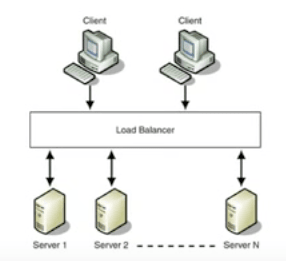

# Scalability

## General

* with any system, there are at least two things to think about
 * amount of traffic (usage per second)
 * amount of data
* will want to know per/second usage (though it's sometimes easier to think about per month)

#### Bottlenecks
* handling a lot of users
* handling a lot of data
* writing to the database is slow

#### Hosting options
* shared hosting
* VPS
  * virtual private server
  * get your own copy of the OS
   data more private from other customers but not hosting company
* Amazon Web Services
  * EC2 Container Service (ECS)
  * can spawn your own servers
  * can set up automated spawning and have those servers power off as traffic declines

## Ways to scale

### Vertical scaling

#### CPU
  * cores, cache built into CPU
  * L1 -> L2 -> L3 ->L4 cache
  * L1 is smallest but fastest cache
  * each core is like a “brain"
  * on single-core CPUs the operating system schedules which apps have access to resources => serial
  * on multi-core servers, the computer can do more than one thing at a time (not just appear to) => parallel processing
  * most servers will have multiple multi-core CPUs
  * with quad-core, server can handle at least 4 requests at a time
  * CPU cores can spawn threads, so will appear to handle more than 4 requests (OS will schedule access just like with single-core CPUs). This is how hosting companies are able to provide powerful VPS (Amazon for example)

#### Add memory
* RAM
* throw resources at the problem
* not a full solution because there are real-world constraints; will eventually hit ceiling
        
#### Disk scaling
* Add storage
* SAS drive
  * fastest mechanical drive
  * where you touch disk you want a SAS drive
  * often databases will be on SAS drives
* SATA drive
  * serial ATA
* SAD
  * solid state drive
  * faster than mechanical drive
  * more expensive but smaller than mechanical drives
    
##### RAID
  * redundant array of independent disks
  * decreases probability of downtime related to disk failure
  * RAID0, RAID1, RAID5, RAID6, RAID10

###### RAID0
* two identical hard drives
* striping — write data across hard drives
* doubles speed at which you can write files

###### RAID1
* two identical drives
* any time you write file, write it in both places (mirror data)
* some performance hit, but if one drive dies, will still have backup
* if drive dies, can be replaced and will rebuild itself

###### RAID5
* striped and mirrored
* any 1 drive can die

###### RAID6
* striped and mirrored
* any 2 drives can die

###### RAID10
* four identical drives
* striping and mirroring (combo of RAID1 and RAID10)
* more expensive

### Horizontal scaling
* every server contains exactly the same codebase and does not store any user-related data, like sessions or profile pictures, on local disc or memory
* architect system so that you can use cheaper hardware
* rather than one really good machine, get a bunch of slower machines
* multiple servers to build out topology
* deploy to multiple servers using a tool like Capistrano
* "super clone” — create an image file from of of the servers to base new instances on
* sessions should be stored in a centralized data store which is accessible to all your app servers
* data store does not reside on the app servers
* two options for sessions
  * external database
  * persistent cache like Redis (will have better performance than db)

### Caching
#### File-based caching
  * pre-rendered html from dynamic content
  * often done on a regular basis such as by a script which runs every hour by cron
  * performance improvement for serving static content
  * good when reads more common than writes
  * redundancy with duplicated code
  * non-trivial to change the look

#### Database caching
  * sql queries
  * slower than in-memory caching

#### In-memory caches
  * recommended
  * example caching systems: Memcached, Redis
  * software you run on a server
  * key-value store in RAM
  * should reside as buffering layer between app and data storage
      * first check cache server; if not there, go get it and add it
  * much faster than database caching
      * can do several hundreds of thousands of read operations per second on a standard server
  * caching objects
      * see data as an object like you already do in code
      * assemble a dataset from db and store the instance of the class in cache
      * eg Product
          * assemble the Product instance
          * store the instance in cache
          * when something changes, get rid of the cached object
      * allows asynchronous processing
          * army of worker servers assembling objects and putting into cache
      * app just consumes the latest cached object and almost never touches the db
      * examples of cacheable objects
          * user sessions (never use the db)
          * fully rendered blog articles
          * activity streams
          * user <--> friend relationships

### Load balancing

* traffic is evenly distributed across multiple servers
* user should get the same result of a request, regardless of which server he landed on
* let load balancer decide how to route traffic
  * back end servers can have private IP addresses (can’t be contacted directly)
  * can use randomness based on server load
* sticky sessions
  * session object will be the same throughout the entire interaction with the web site
  * all interactions happen on the same physical server
* can be implemented in software or hardware
  * software => ELB, HAProxy, LVS
  * hardware => Barracuda, F5

> *Load balancing*
>
> 

### Database replication
  * there is one main read/write database, which is called master
    * when writing to master, writes to slave
    * in theory slave is identical to master
    * advantages
      * if one dies, have backup that can go online right away
      * distribution of read traffic across slaves
    * configurations
      * single master
      * master-master
      * complicated topology

> *Master-master*
>
> 

 

> *Single Master*
>
> 
        
 

> *Complicated topology*
>
> 

### Database sharding

#### What is it?
* horizontal partition of data
* each partition is known as a shard
* each shard is a separate server instance, to spread load
* balance load based on high-level user information (like last name)
* suggestion is to only shard after you've optimized everything else first

#### How is sharding different than traditional architectures?
* data are denormalized — store data together that are used together
* data are parallelized across many physical instances
* data are kept small
* data are more highly available
* doesn’t use replication (no master-slave replication)

#### Advantages
* scales horizontally, so you can do more work simultaneously
* high availability — if one goes down, the others still operate
* faster queries — smaller amounts of data
* more write bandwidth — no master db so can write in parallel

#### Problems
* rebalancing data — data outgrows storage and needs to be moved to a different shard
* joining data from multiple shards
* how do you partition your data?
* not has much expertise in the industry because it’s not as common
* not well supported by common tools (roll-your-own)
        
> *Partitioning*
>
> 

### Asynchronous processing (messaging)
* create a queue of tasks or jobs that a worker can process
* workflow
  1. user comes to site and starts intensive tasks which would take several minutes to finish
  * site sends a job to the queue and signals to user: job is in progress, please continue to browse
  * worker picks up job from queue
  * after the job is complete, sends a signal that the job is done
  * when the front end sees the job is done, informs the user
* RabbitMQ, ActiveMQ are examples of message brokers

## Reverse proxy

* known as a “gateway” server
* Apache and many other web servers can act as a reverse proxy
* server itself does not generate or host data
* content is obtained by backed servers, which have no direct connection to the external network

### Why?
* security
* high-availability
* load-balancing
* centralized authentication
        
> *Reverse proxy*
> 
> 
